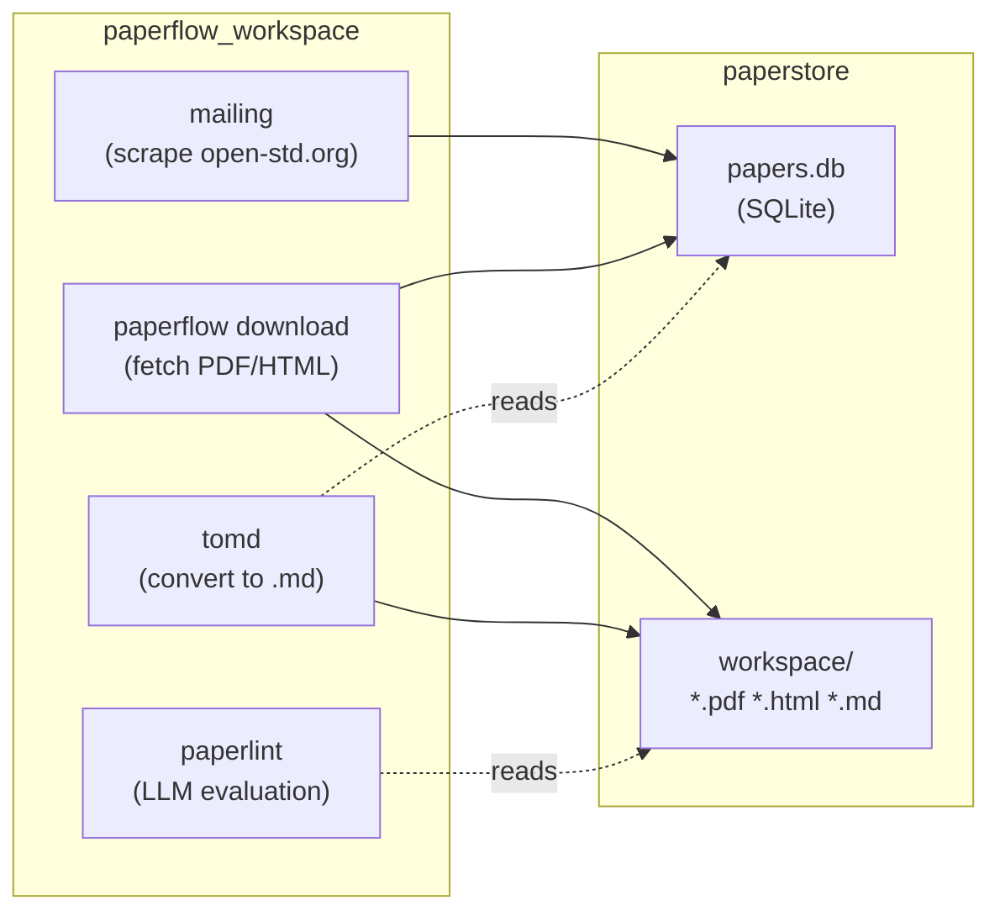

# QA-003: tomd Deep Analysis (No Code)

**Status:** RESEARCH COMPLETE
**Author:** Sergio DuBois
**Date:** April 28, 2026
**Scope:** Pure analysis, no code changes

This is a pure research document. No code will be written. The goal is to fully understand how tomd works, what breaks, why, and where improvements would have the highest impact.

---

## 1. What tomd IS

A purpose-built PDF/HTML-to-Markdown converter for WG21 (C++ standards committee) papers. Not a general-purpose converter. It understands WG21 metadata (document number, date, audience, reply-to), structural elements (headings, lists, tables, code, wording sections), and produces Markdown that looks like a human wrote it.

**Key design principle from [CLAUDE.md](packages/tomd/src/tomd/CLAUDE.md):** "Never classify based on a single signal. Every structural decision must consider all available signals and produce a confidence level."

---

## 2. Where tomd Lives in the System

**Dependency chain:** `mailing` -> `download` -> `tomd` -> `paperlint`. Each stage requires the previous. tomd reads `source_path` + `meta` from paperstore, writes `{pid}.md` (+ optional `{pid}.prompts.json`) back to the workspace.

**Entry points:**
- `python -m tomd <ids...>` (direct CLI)
- `paperflow convert <mailing-id>` -> `paperlint.orchestrator.convert_one_paper` -> `tomd.api.convert_paper`

Both end up calling the same `convert_paper(paper_id, source_path, meta)` in [tomd/api.py](packages/tomd/src/tomd/api.py).

---

## 3. External Dependencies

- **pymupdf (fitz) ~=1.27.0**: PDF text extraction (dual-path), link collection, hidden region detection, line drawings. This is the ONLY PDF library. Everything tomd knows about a PDF comes through fitz.
- **beautifulsoup4 ~=4.14.0**: HTML parsing and DOM traversal (HTML pipeline only)
- **mistune ~=3.2.0**: QA scoring only (parse markdown to AST for structural analysis)
- **ftfy >=6.1**: QA scoring only (mojibake detection via `badness()`)
- **paperstore** (workspace): Storage backend (SQLite + filesystem)

---

## 4. The PDF Pipeline (39 Techniques, 11 Layers)

Full details in [lib/pdf/ARCHITECTURE.md](packages/tomd/src/tomd/lib/pdf/ARCHITECTURE.md). Orchestrated by [lib/pdf/\_\_init\_\_.py](packages/tomd/src/tomd/lib/pdf/__init__.py) (~295 lines).

```mermaid
flowchart TD
    subgraph L1 ["Layer 1: Extraction"]
        T0["T0: Early exits\n(slide deck, standards draft)"]
        T1["T1: MuPDF dict-path"]
        T2["T2: Spatial rawdict-path"]
        T3["T3: Monospace classification\n(4 signals)"]
        T4["T4: Mono propagation\n(spatial to MuPDF)"]
        T5["T5: Link collection"]
    end
    subgraph L2 ["Layer 2: Cleanup"]
        T7["T7: Header/footer strip"]
        T8["T8: Text normalization"]
        T9["T9: Dehyphenation"]
        T10["T10: Cross-page join"]
    end
    subgraph L345 ["Layers 3-5: Normalize + Tables + Wording"]
        T13["T13: Style boundary snap"]
        T14["T14: Table detection\n(2-signal)"]
        T17["T17: Wording detection\n(HSV color + drawings)"]
    end
    subgraph L6 ["Layer 6: Dual-Path Comparison"]
        T20["T20: compare_extractions\n(0.85 word similarity)\n5 fallback stages"]
    end
    subgraph L7 ["Layer 7: Structure"]
        T23["T23: Heading classification\n(5 signals, 11 outcomes)"]
        T24["T24: List detection\n(regex + position)"]
        T26["T26: Code block detection\n(consecutive monospace)"]
    end
    subgraph L89 ["Layers 8-9: TOC + Emit"]
        T29["T29: TOC removal"]
        T30["T30-T37: Emit markdown\n+ prompts + front matter"]
    end
    L1 --> L2 --> L345 --> L6 --> L7 --> L89
```

### 4a. The Dual-Path Mechanism (Core Innovation)

Every PDF page extracted twice independently:

- **MuPDF path** (`get_text("dict")`): MuPDF's internal block/line/span grouping. Battle-tested but opaque.
- **Spatial path** (`get_text("rawdict")`): Per-character coordinates, sorted into reading order by geometric rules (4 threshold branches in [extract.py](packages/tomd/src/tomd/lib/pdf/extract.py)).

Both produce the same data model (`Span -> Line -> Block`). Then `compare_extractions()` in [structure.py](packages/tomd/src/tomd/lib/pdf/structure.py) measures word-level multiset similarity per page:

- >= 0.85 threshold: HIGH confidence, use MuPDF blocks
- < 0.85 threshold: UNCERTAIN, mark with `<!-- tomd:uncertain -->`, emit MuPDF text, put both versions in prompts.json

5 fallback stages try to rescue uncertain pages: NFC normalization, page-pair window, document-level pool, tiny-region demotion.

### 4b. Code Block Detection Chain

1. [mono.py](packages/tomd/src/tomd/lib/pdf/mono.py) `classify_monospace`: 4 signals (font name keywords, glyph width CV, glyph spacing CV, fat/thin ratio). Needs 2+ signals or signal 3 alone.
2. [mono.py](packages/tomd/src/tomd/lib/pdf/mono.py) `propagate_monospace`: Spatial path results applied to MuPDF spans.
3. [structure.py](packages/tomd/src/tomd/lib/pdf/structure.py) `_detect_code_blocks`: Consecutive all-monospace sections merged into CODE sections. Empty sections between mono runs are bridged.
4. [qa.py](packages/tomd/src/tomd/lib/pdf/qa.py) `_STRUCTURAL_CODE_RE`: Post-hoc detection of unfenced code in the final markdown (separate from pipeline, detection only).

### 4c. Table Detection

[table.py](packages/tomd/src/tomd/lib/pdf/table.py): Two-signal detection (block structure + geometric column profile). **Known limitation:** same-page-only orphan absorption. Cross-page wrapped cells split tables.

### 4d. Wording Detection

[wording.py](packages/tomd/src/tomd/lib/pdf/wording.py): Three-layer approach (block color filter, line-level green/red majority, span-level color + strikethrough drawings). Threshold: fewer than 5 ins/del spans = skip entirely.

---

## 5. The HTML Pipeline (18 Techniques, 5 Layers)

Much simpler. Single source of truth (DOM tree). No dual-path, no uncertainty, no spatial analysis.

6 steps: parse (BeautifulSoup) -> detect generator -> extract metadata -> strip boilerplate -> render DOM -> assemble output.

6 generator families: mpark/wg21, Bikeshed, HackMD, wg21 cow-tool, hand-written, unknown.

663 lines total vs 4132 lines for PDF. Documented in [lib/html/ARCHITECTURE.md](packages/tomd/src/tomd/lib/html/ARCHITECTURE.md).

---

## 6. Test Coverage Map

### Golden Tests (exact full-document comparison)

- **PDF:** 8 papers (P0533R9, P0957R8, P1068R11, P3556R0, P1122R3, P2040R0, P3714R0, P1112R4) in [test_pdf_golden.py](packages/tomd/tests/test_pdf_golden.py)
- **HTML:** 7 papers (P3411R5, P2728R11, P3953R0, P4005R0, P4020R0, P3911R2, N5034) in [test_html_golden.py](packages/tomd/tests/test_html_golden.py)
- All golden tests **skip if source PDFs/HTMLs not present** (developer must download)

### Unit Tests by Area

- Dual-path comparison: `test_structure.py` (extensive)
- Monospace detection: `test_mono.py` (signal combinations)
- Table detection: `test_table.py` (two-signal patterns)
- Wording detection: `test_wording.py` (color + drawing correlation)
- QA scoring: `test_qa.py` (37 tests, our QA-001 + hardening)
- HTML extraction: `test_html_extract.py` (per-generator metadata)
- HTML rendering: `test_html_render.py` (DOM element types)

### Gaps

- `extract_mupdf` and full dual-path extraction only tested through goldens (not unit-tested in isolation)
- Reference fixtures (`d4036-why-not-span.md`, `p2583r3-symmetric-transfer.md`) exist in `tests/fixtures/reference/` but are **not wired into any test**
- Corpus-scale behavior only testable via manual `tomd --qa`

---

## 7. Corpus Quality Snapshot (2026 Corpus, 100 Papers in qa-report.json)

### Score Distribution

| Bucket | Count | Percentage |
|---|---|---|
| 100 (perfect) | 46 | 46% |
| 90-99 | 19 | 19% |
| 80-89 | 28 | 28% |
| 70-79 | 4 | 4% |
| 60-69 | 1 | 1% |
| Below 60 | 2 | 2% |

65% of papers score 90+. Only 7 papers score below 80. The quality baseline is better than initially assumed, but the worst papers are significantly broken.

### Issue Categories

| Issue | Papers Affected | Root Cause |
|---|---|---|
| Unfenced code (11 papers below 90) | P2964R2 (661), P3666R3 (274), P2953R3/R4 (204 each), P3642R4 (93), P3688R6 (75), etc. | Mono detection fails: proportional fonts in code, code in tables, mixed prose/code |
| Uncertain regions (8 papers below 90) | P3977R0 (4), P4142R0 (4), P3596R0 (3), P4016R0 (3), P3856R7 (3), P4182R0 (3), P3948R1 (2), P3856R8 (2) | Dual-path word similarity below 0.85. Complex layouts, cross-page tables, unusual fonts |
| Mojibake (5 papers, not yet in qa-report) | P3904R1 (25), P2728R11 (16), P3596R0 (2), P2956R2 (1), P3052R2 | Encoding corruption in source PDFs. Detected by QA-001 but not in this report (generated pre-QA-001). |

---

## 7b. Worst Papers Tracking (Pre-Improvement Baseline)

Source: `qa-report.json` (100 papers from 2026 corpus). All 15 papers scoring below 90:

| Rank | Paper | Score | Unfenced Lines | Uncertain Regions | Issues |
|---|---|---|---|---|---|
| 1 | P3977R0 | **56** | 12 | 4 | 4 uncertain regions, 12 unfenced code lines |
| 2 | P3596R0 | **61** | 16 | 3 | 3 uncertain regions, 16 unfenced code lines |
| 3 | P4142R0 | **68** | 0 | 4 | 4 uncertain regions |
| 4 | P4016R0 | **70** | 6 | 3 | 3 uncertain regions, 6 unfenced code lines |
| 5 | P3856R7 | **76** | 5 | 3 | 3 uncertain regions |
| 6 | P4182R0 | **76** | 0 | 3 | 3 uncertain regions |
| 7 | P3948R1 | **77** | 7 | 2 | 2 uncertain regions, 7 unfenced code lines |
| 8 | P3856R8 | **84** | 4 | 2 | 2 uncertain regions |
| 9 | P2953R3 | **85** | 204 | 0 | 204 unfenced code lines |
| 10 | P2929R2 | **85** | 17 | 0 | 17 unfenced code lines |
| 11 | P2953R4 | **85** | 204 | 0 | 204 unfenced code lines |
| 12 | P2964R2 | **85** | 661 | 0 | 661 unfenced code lines |
| 13 | P3642R4 | **85** | 93 | 0 | 93 unfenced code lines |
| 14 | P3666R3 | **85** | 274 | 0 | 274 unfenced code lines |
| 15 | P3688R6 | **85** | 75 | 0 | 75 unfenced code lines |

Note: mojibake detection (QA-001) was added after this report was generated. Re-running `tomd --qa` will show additional penalties for P3904R1, P2728R11, P3596R0, P2956R2, P3052R2.

After each improvement, re-run `tomd --qa` on these papers and compare.

---

## 8. Known Limitations (from CLAUDE.md + ARCHITECTURE.md)

- No OCR (image-only PDFs unsupported)
- No vision fallback (equations, diagrams will not convert)
- Slide decks and standards drafts (>= 200 pages) skipped entirely
- Cross-page table cells split (same-page-only orphan absorption)
- LLM auto-resolution of uncertain regions deferred to v2
- `test_structure.py` encodes known imperfections (e.g. `test_current_behavior_flattens_legit_nesting_same_font`)

---

## 9. Improvement Candidates (Research Only)

Ranked by impact-to-complexity ratio:

1. **Unfenced code: content-based detection** as supplement to font-based mono detection. Use `_STRUCTURAL_CODE_RE` patterns (braces, semicolons, `#include`, function declarations) in a post-structuring pass. Impact: HIGH (20+ papers). Complexity: MEDIUM.

2. **Mojibake auto-repair** via `ftfy.fix_encoding()`. Impact: MEDIUM (5 papers). Complexity: LOW mechanically but HIGH risk (could corrupt valid C++ syntax, math, or HTML tags). Needs safety research.

3. **Uncertain region reduction** by tuning the 0.85 threshold or improving promotion logic. Impact: MEDIUM (~14 papers). Complexity: HIGH (touches core confidence mechanism).

4. **Cross-page table handling**. Impact: LOW-MEDIUM. Complexity: HIGH (fundamental architecture change to table.py).

5. **Wire reference fixtures into tests**. Impact: LOW (no conversion change). Complexity: LOW.

### Cross-Reference: QA-002 (mpark/wg21 Framework)

[QA-002](plans/QA-002-mpark-wording-support.md) covers mpark/wg21 framework support. Three findings from QA-002 are potential root causes for issues tracked here:

- **mpark color patterns**: mpark PDFs use red/green text for wording deletions/additions without strikethrough. If `wording.py`'s three-layer detection misclassifies these spans, surrounding content may end up as unfenced paragraphs instead of structured wording blocks. Could explain some unfenced code counts in papers that contain wording sections.
- **LaTeX Unicode (xelatex)**: mpark documents known issues with Unicode in LaTeX-generated PDFs. Different font rendering from xelatex could cause mojibake or mono-detection failures (font name signals differ from standard PDF generators).
- **Tony Tables (cmptable)**: mpark's two-column comparison tables may interact with `table.py`'s same-page-only detection. Code inside table cells is not recognized by `mono.py`'s consecutive-monospace logic, contributing to unfenced code counts.

Shared test asset: `tests/fixtures/reference/p2583r3-symmetric-transfer.md` (wording section example) is relevant to both QA-002 and QA-003.

---

## 10. Files to Read Before Any Code Change

**Architecture (must read):**
- [CLAUDE.md](packages/tomd/src/tomd/CLAUDE.md)
- [lib/pdf/ARCHITECTURE.md](packages/tomd/src/tomd/lib/pdf/ARCHITECTURE.md)
- [lib/html/ARCHITECTURE.md](packages/tomd/src/tomd/lib/html/ARCHITECTURE.md)
- [README.md](packages/tomd/src/tomd/README.md)

**Core pipeline (must read before editing):**
- [lib/pdf/\_\_init\_\_.py](packages/tomd/src/tomd/lib/pdf/__init__.py) (~295 lines, pipeline orchestration)
- [lib/pdf/structure.py](packages/tomd/src/tomd/lib/pdf/structure.py) (~939 lines, largest module)
- [lib/pdf/extract.py](packages/tomd/src/tomd/lib/pdf/extract.py) (~249 lines, dual-path)
- [lib/pdf/emit.py](packages/tomd/src/tomd/lib/pdf/emit.py) (~401 lines, markdown generation)
- [lib/pdf/mono.py](packages/tomd/src/tomd/lib/pdf/mono.py) (code detection)

**Quality:**
- [lib/pdf/qa.py](packages/tomd/src/tomd/lib/pdf/qa.py) (~445 lines, our QA-001 work)
- [tests/fixtures/golden/README.md](packages/tomd/tests/fixtures/golden/README.md) (golden test workflow)

**Total codebase:** ~4132 lines PDF pipeline + 663 lines HTML pipeline + ~445 lines QA = ~5240 lines of converter code.

---

## 11. Existing Reviews and Evaluations (Previously Missing from Plan)

Four documents we discovered during deep analysis that contain critical insights:

### 11a. Vinnie Falco's Evaluation ([tomd-eval.md](packages/tomd/src/tomd/doc/archive/2026-04/tomd-eval.md))

Vinnie's own assessment (April 2026). Key findings relevant to our work:

- `convert_pdf` returns `("", None)` for both empty documents AND unreadable PDFs: two different conditions collapsed into identical output
- Bare `except Exception` handling and non-atomic output writes create silent failure modes
- "Complete absence of tests" at time of writing (now partially addressed by our QA-001)
- Unpinned PyMuPDF dependency (now pinned to ~=1.27.0)
- Verdict: "Promising, a tool whose core algorithm deserves better infrastructure"

### 11b. Converter Comparison ([compare-pdf-convert.md](packages/tomd/src/tomd/doc/archive/2026-04/compare-pdf-convert.md))

tomd vs CppDigest/wg21-paper-markdown-converter. Key takeaway: tomd is the only rule-and-geometry-first converter with explicit confidence scoring. CppDigest uses a three-tier fallback (docling -> pdfplumber -> OpenRouter Vision LLM). tomd trades breadth for precision, CppDigest trades precision for availability. They complement each other.

### 11c. Design Review ([lib-review.md](packages/tomd/src/tomd/lib-review.md))

External review by kimi-k2.5 (April 2025). Flags: API structural commitment (dataclass fields without versioning), documentation vacuum (no user-facing README at time of review, now exists), and "adoption friction for external users."

### 11d. Code Review ([review.md](packages/tomd/src/tomd/review.md))

Code review by kimi-k2.5 (April 15 2026). Flags: duplicated whitespace normalization logic across renderers, multiple metadata extraction pathways needing careful merging, naming inconsistencies between monospace-related functions. Praises: no circular dependencies, good type cohesion in types.py, clean pipeline phases.

---

## 12. YAML Front-Matter Contract (from DESIGN.md Section 7)

[DESIGN.md](DESIGN.md) Section 7 is the **authoritative spec** for tomd's YAML output. Key rules:

- Canonical field order: `title`, `document`, `date`, `intent`, `audience`, `reply-to`
- tomd extracts from source PDF/HTML; absent fields stay absent (mailing fills them later)
- `intent` in YAML can override scraper intent (with warning to stderr)
- Audience normalization rules are **not yet fully defined** (open item)
- Quoting rules for special characters defined in the spec

This contract constrains any changes to `format_front_matter` in [lib/\_\_init\_\_.py](packages/tomd/src/tomd/lib/__init__.py).

---

## 13. Known Crasher Bugs (from review.md Code Review)

Three bugs identified by kimi-k2.5 code review (April 15 2026) that can crash or corrupt conversion:

| Bug | File | Risk | Description |
|---|---|---|---|
| Empty bboxes | [extract.py](packages/tomd/src/tomd/lib/pdf/extract.py) ~line 17 | ValueError | `min`/`max` on empty bbox list crashes |
| Empty font_counts | [\_\_init\_\_.py](packages/tomd/src/tomd/lib/pdf/__init__.py) ~line 133 | IndexError | `most_common(1)[0][0]` on empty Counter crashes on PDFs with no text spans |
| Reply-to over-consumption | [wg21.py](packages/tomd/src/tomd/lib/pdf/wg21.py) ~lines 162-179 | Wrong markdown | Continuation logic can eat body content on malformed PDFs |

These are pre-existing bugs, not introduced by our work. Fixing them would be a separate PR.

---

## 14. Downstream Risk: paperlint Quote Verification

From [paperlint CLAUDE.md](packages/paperlint/src/paperlint/CLAUDE.md): `step_verify_quotes` does **literal or whitespace-normalized substring matching** against the paper markdown. This means:

- Any change to how tomd emits text (whitespace, line breaks, escaping) can cause previously-verified findings to fail verification and be dropped
- This is not a blocker for quality improvements, but it means large emission changes should be tested against existing evaluations
- The integration test (`tests/test_end_to_end_convert.py`) only checks non-empty output, not content stability

---

## 15. Complete Documentation Inventory

All documentation files read during this analysis:

### Root Level
- [CLAUDE.md](CLAUDE.md) - Workspace rules, CLI commands, on-disk layout, invariants, style
- [DESIGN.md](DESIGN.md) - Architecture, pipeline, paper model, YAML spec, backends, known limitations
- [README.md](README.md) - User-facing install/usage docs
- [CONCURRENCY-TODO.md](CONCURRENCY-TODO.md) - Race conditions in parallel convert/eval (open)
- [LICENSE_1_0.txt](LICENSE_1_0.txt) - Boost Software License 1.0

### Package CLAUDE.md Files (5 total, 0 AGENTS.md)
- [root CLAUDE.md](CLAUDE.md) - Storage through backend, no em dashes, BSL-1.0 headers
- [tomd CLAUDE.md](packages/tomd/src/tomd/CLAUDE.md) - 17-step pipeline, multi-signal confidence, dual-path, heading rules, honest output, QA scorer rules
- [paperstore CLAUDE.md](packages/paperstore/src/paperstore/CLAUDE.md) - Flat workspace layout, typed errors, meta fallback to mailing index
- [mailing CLAUDE.md](packages/mailing/src/mailing/CLAUDE.md) - No tomd dependency, put_source is the write seam
- [paperlint CLAUDE.md](packages/paperlint/src/paperlint/CLAUDE.md) - Eval reads stored markdown, quote verification, prompt_hash

### tomd-Internal Documentation (12 .md files)
- [README.md](packages/tomd/src/tomd/README.md) - CLI usage, QA mode, limitations
- [CLAUDE.md](packages/tomd/src/tomd/CLAUDE.md) - Agent rules, pipeline, module map
- [lib/pdf/ARCHITECTURE.md](packages/tomd/src/tomd/lib/pdf/ARCHITECTURE.md) - 39 techniques, 11 layers
- [lib/html/ARCHITECTURE.md](packages/tomd/src/tomd/lib/html/ARCHITECTURE.md) - 18 techniques, 5 layers
- [lib-review.md](packages/tomd/src/tomd/lib-review.md) - Design review (kimi-k2.5, April 2025)
- [review.md](packages/tomd/src/tomd/review.md) - Code review (kimi-k2.5, April 2026)
- [doc/archive/2026-04/tomd-eval.md](packages/tomd/src/tomd/doc/archive/2026-04/tomd-eval.md) - Vinnie's evaluation
- [doc/archive/2026-04/compare-pdf-convert.md](packages/tomd/src/tomd/doc/archive/2026-04/compare-pdf-convert.md) - tomd vs CppDigest
- [doc/archive/2026-04/wg21-paper-markdown-converter-eval.md](packages/tomd/src/tomd/doc/archive/2026-04/wg21-paper-markdown-converter-eval.md) - CppDigest eval (not about tomd)
- [doc/archive/2026-04/README.md](packages/tomd/src/tomd/doc/archive/2026-04/README.md) - Archive index

### Test Documentation
- [tests/fixtures/golden/README.md](packages/tomd/tests/fixtures/golden/README.md) - Golden test workflow
- 499 tests in tomd package, 1 integration test in root `tests/`

### CI/CD
- [.github/workflows/notify-superproject-vendor-pin.yml](.github/workflows/notify-superproject-vendor-pin.yml) - Release dispatch only, no test CI

---

## 16. Key Answers from Deep Analysis

| Question | Answer |
|---|---|
| Do prompts influence the result? | No. `prompts.json` is an output artifact, never read back. No LLM calls anywhere in tomd. |
| Is any AI involved? | No. Pure deterministic: PyMuPDF + geometry + regex. Zero imports of openai/anthropic/etc. |
| Why do some papers convert well and others poorly? | Three causes: (1) tomd mono detection fails on proportional-font code, (2) source PDFs have encoding corruption, (3) complex layouts confuse dual-path comparison. |
| Are golden tests running locally? | Probably not. They skip when source PDFs are absent. Developer must download them manually. |